# 🚚 GIU Food Truck System

## Project Title and Description

**GIU Food Truck Management System** - A full-stack web application for managing food truck operations on campus. This system allows customers to browse food trucks, view menus, place orders, and track their orders. Truck owners can manage their menus, working hours, workers, view analytics, and update order statuses. Workers can manage orders through a dedicated dashboard.

### Team Members

| Name | ID | Tutorial |
|------|-----|----------|
| Salah El Begermy | 16003012 | T13 |
| Yassin Waleed | 16007900 | T13 |
| Omar Haitham | 16006573 | T13 |
| Ahmed Hatem | 16009890 | T13 |
| Youssef Mostafa | 16002362 | T13 |
| Tawfik Tarek | 16005307 | T13 |
| Omar Mohamed | 16008566 | T02 |
| Khaled El Qamesh | 16002001 | T17 |

---

## 🌟 Features

### 👤 Customer Features
- **User Authentication**: Login and registration with role selection (visual feedback)
- **Browse Trucks**: View all available food trucks with status indicators
- **View Menu**: Browse menu items by category for each truck
- **Shopping Cart**: Add items, modify quantities, remove items with real-time updates
- **Place Orders**: Select pickup date and time slot, place orders
- **Order Tracking**: View order status updates in real-time
- **Order History**: View past orders with detailed breakdowns

### 🏪 Truck Owner Features
- **Owner Dashboard**: View truck stats (revenue, orders, menu items), pending/completed orders
- **Toggle Availability**: Enable/disable order acceptance with instant feedback
- **Menu Management**: View, add, edit, and delete menu items with categories
- **Working Hours**: Set operating hours for each day of the week
- **Time Slots**: Auto-generated based on operating hours (30-min intervals)
- **Workers Management**: Add, view, and manage food truck workers
- **Sales Analytics**: Real-time analytics with revenue, orders, top items, peak hours
- **Order Management**: View all orders, filter by status, update order status

### 👷 Worker Features
- **Worker Dashboard**: Dedicated dashboard for order management
- **Order Queue**: View all pending, confirmed, preparing, and ready orders
- **Status Updates**: Update order status with one click (Confirm → Preparing → Ready → Picked Up)
- **Order Details**: View complete order information including items and special instructions
- **Real-time Refresh**: Auto-refresh order list every 30 seconds

---

## 📸 Screenshots

### Customer Experience

#### Home Page
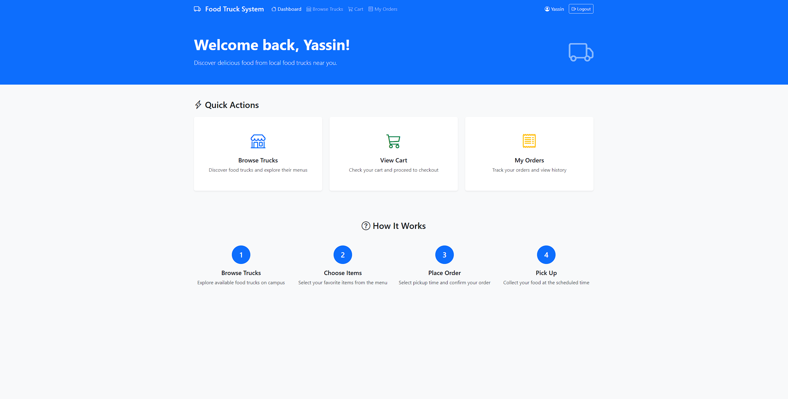

#### Browse Food Trucks
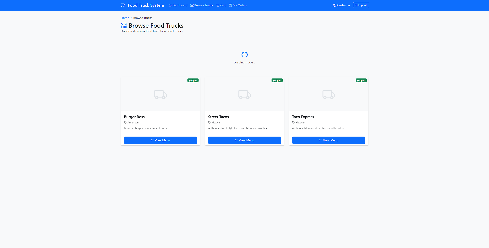

#### Menu Items
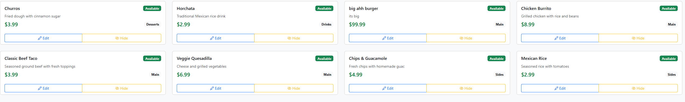

#### Shopping Cart & Checkout
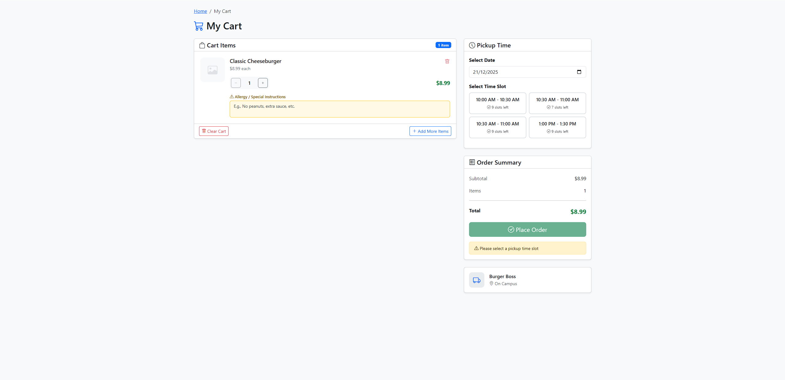

#### Order Confirmation
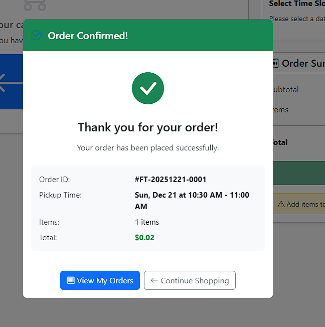

---

### Owner Dashboard

#### Main Dashboard
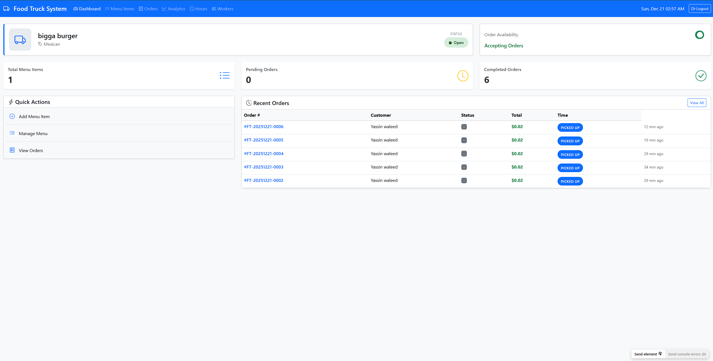

#### Menu Management
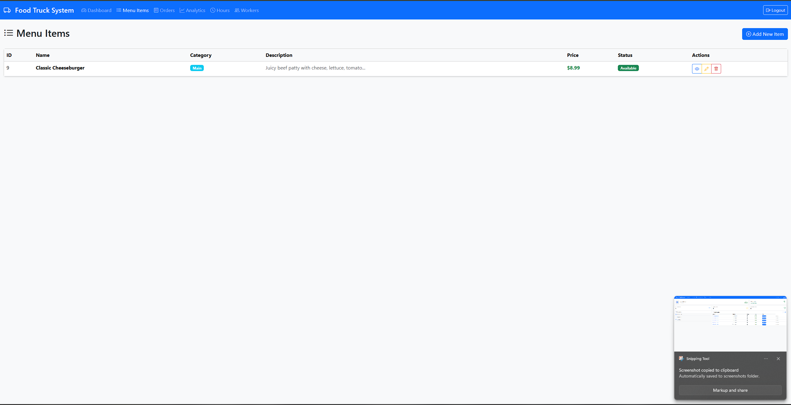

#### Order Management
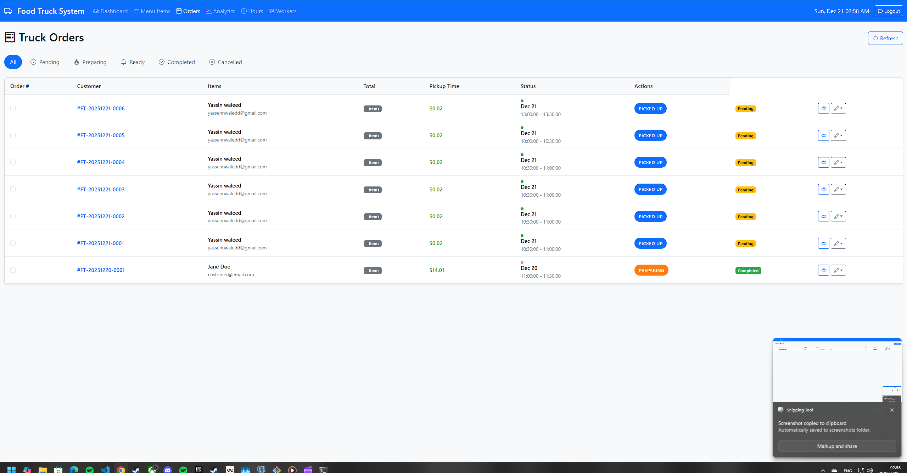

#### Sales Analytics
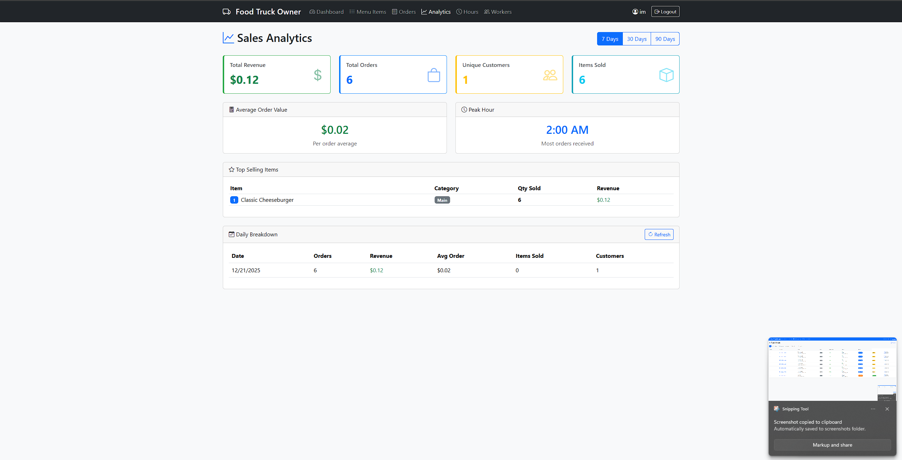

#### Working Hours
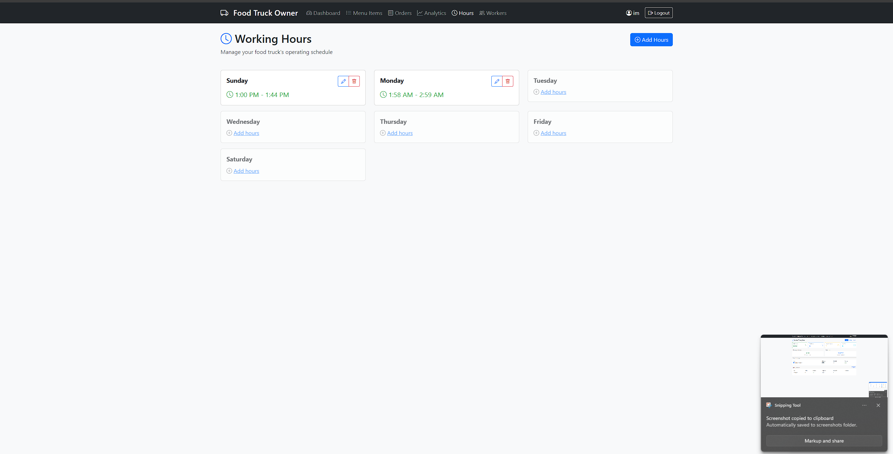

#### Workers Management
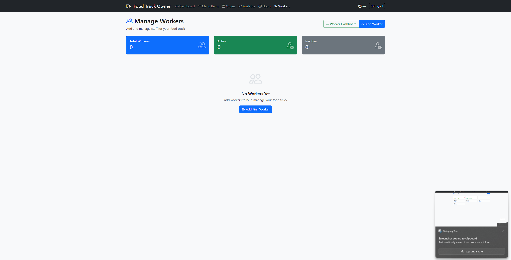

---

### Worker Dashboard
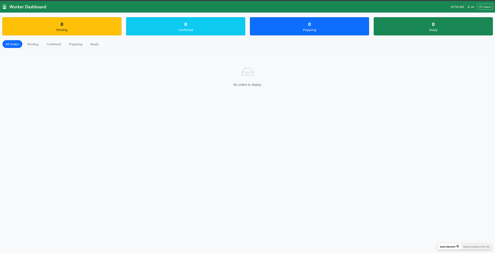

---

## Technology Stack

### Frontend
- **HTML** - Page structure using HJS templates
- **CSS** - Custom styles + Bootstrap 5
- **JavaScript** - Frontend logic with jQuery
- **AJAX** - API requests using jQuery $.ajax()

### Backend
- **Runtime:** Node.js
- **Framework:** Express.js
- **Database:** PostgreSQL
- **Authentication:** JWT (JSON Web Tokens)
- **Password Hashing:** bcrypt

---

## ERD (Entity Relationship Diagram)

### Core Tables

```
users
├── user_id (PK)
├── email (UNIQUE)
├── password_hash
├── first_name
├── last_name
├── user_type (customer/owner/worker)
└── is_active

customers
├── customer_id (PK)
├── user_id (FK → users)
├── default_address
└── loyalty_points

owners
├── owner_id (PK)
├── user_id (FK → users)
└── business_license

food_trucks
├── food_truck_id (PK)
├── owner_id (FK → owners)
├── name
├── cuisine_type
├── description
├── is_active
└── image_url

menu_items
├── menu_item_id (PK)
├── food_truck_id (FK → food_trucks)
├── name
├── description
├── price
├── category
├── is_available
└── image_url

orders
├── order_id (PK)
├── customer_id (FK → customers)
├── food_truck_id (FK → food_trucks)
├── time_slot_id (FK → time_slots)
├── order_status
├── total_amount
├── payment_status
└── created_at

order_items
├── order_item_id (PK)
├── order_id (FK → orders)
├── menu_item_id (FK → menu_items)
├── quantity
└── unit_price

cart_items
├── cart_item_id (PK)
├── user_id (FK → users)
├── menu_item_id (FK → menu_items)
└── quantity

time_slots
├── time_slot_id (PK)
├── food_truck_id (FK → food_trucks)
├── slot_date
├── start_time
├── end_time
├── max_orders
├── current_orders
└── is_active

operating_hours
├── operating_hour_id (PK)
├── food_truck_id (FK → food_trucks)
├── day_of_week (0-6)
├── open_time
├── close_time
└── is_active

workers
├── worker_id (PK)
├── user_id (FK → users)
├── food_truck_id (FK → food_trucks)
├── position
├── hourly_rate
└── is_active

order_status_history
├── history_id (PK)
├── order_id (FK → orders)
├── previous_status
├── new_status
├── changed_by
└── created_at

analytics
├── analytics_id (PK)
├── food_truck_id (FK → food_trucks)
├── analytics_date
├── total_orders
├── total_revenue
├── avg_order_value
└── unique_customers
```

---

## Installation and Setup

### Prerequisites
- Node.js (v14 or higher)
- PostgreSQL (v12 or higher)
- npm or yarn

### Step-by-Step Installation

1. **Clone the repository**
```bash
git clone [repository-url]
cd food-truck-api
```

2. **Install dependencies**
```bash
npm install
```

3. **Configure environment**
Create a `.env` file:
```env
DB_HOST=localhost
DB_PORT=5432
DB_NAME=food_truck_db
DB_USER=postgres
DB_PASSWORD=your_password
PORT=3000
JWT_SECRET=your-secret-key
```

4. **Setup database**
```bash
psql -U postgres -c "CREATE DATABASE food_truck_db;"
psql -U postgres -d food_truck_db -f sql/000_create_user_tables.sql
psql -U postgres -d food_truck_db -f sql/001_create_tables.sql
psql -U postgres -d food_truck_db -f sql/002_create_orders_tables.sql
```

5. **Start the server**
```bash
npm run dev
```

6. **Access the application**
Open http://localhost:3000 in your browser

---

## Test Credentials

| Role | Email | Password |
|------|-------|----------|
| Customer | customer@test.com | password123 |
| Owner | owner@test.com | password123 |

---

## Screenshots

### Public Pages
1. **Login Page** - `/` - Email and password login form
2. **Register Page** - `/register` - New user registration

### Customer Pages
3. **Customer Dashboard** - `/dashboard` - Welcome page with quick actions
4. **Browse Trucks** - `/trucks` - Grid of available food trucks
5. **Truck Menu** - `/truckMenu/:truckId` - Menu items with add to cart
6. **Shopping Cart** - `/cart` - Cart items with quantity controls
7. **My Orders** - `/myOrders` - Order history with status tracking

### Owner Pages
8. **Owner Dashboard** - `/ownerDashboard` - Stats and quick actions
9. **Menu Items** - `/menuItems` - Table of menu items with CRUD
10. **Add Menu Item** - `/addMenuItem` - Form to create new item
11. **Truck Orders** - `/truckOrders` - Orders with status management

---

## API Endpoints Summary

### Public Endpoints
| Method | Endpoint | Description |
|--------|----------|-------------|
| POST | `/api/users/register` | Register new user |
| POST | `/api/users/login` | User login |

### Customer Endpoints
| Method | Endpoint | Description |
|--------|----------|-------------|
| GET | `/api/food-trucks` | View available trucks |
| GET | `/api/menu-items?food_truck_id=:id` | View truck menu |
| POST | `/api/cart` | Add item to cart |
| GET | `/api/cart/:userId` | View cart |
| PUT | `/api/cart/:cartId` | Update cart quantity |
| DELETE | `/api/cart/:cartId` | Remove from cart |
| POST | `/api/orders` | Place order |
| GET | `/api/orders?customer_id=:id` | View my orders |
| GET | `/api/orders/:orderId` | View order details |

### Truck Owner Endpoints
| Method | Endpoint | Description |
|--------|----------|-------------|
| POST | `/api/menu-items` | Create menu item |
| GET | `/api/menu-items?food_truck_id=:id` | View my menu items |
| GET | `/api/menu-items/:itemId` | View specific item |
| PUT | `/api/menu-items/:itemId` | Edit menu item |
| DELETE | `/api/menu-items/:itemId` | Delete menu item |
| GET | `/api/food-trucks` | View my truck info |
| PUT | `/api/food-trucks/:id` | Update availability |
| GET | `/api/orders/:orderId` | View order details |
| GET | `/api/orders?food_truck_id=:id` | View truck orders |
| PATCH | `/api/orders/:orderId/status` | Update order status |

---

## Contributors

| Team Member | Contributions |
|-------------|---------------|
| [Name 1] | Login/Register pages, Authentication |
| [Name 2] | Customer Dashboard, Browse Trucks |
| [Name 3] | Truck Menu, Shopping Cart |
| [Name 4] | My Orders, Order Details |
| [Name 5] | Owner Dashboard |
| [Name 6] | Menu Items Management |
| [Name 7] | Truck Orders Management |
| [Name 8] | Backend API Integration |

---

## Project Structure

```
food-truck-api/
├── public/
│   ├── src/                    # JavaScript files
│   │   ├── api.js              # API client
│   │   ├── login.js
│   │   ├── register.js
│   │   ├── trucks.js
│   │   ├── truckMenu.js
│   │   ├── cart.js
│   │   ├── myOrders.js
│   │   ├── ownerDashboard.js
│   │   ├── menuItems.js
│   │   ├── addMenuItem.js
│   │   └── truckOrders.js
│   └── css/
│       └── style.css
├── views/                      # HJS templates
│   ├── login.hjs
│   ├── register.hjs
│   ├── customerHomepage.hjs
│   ├── trucks.hjs
│   ├── truckMenu.hjs
│   ├── cart.hjs
│   ├── myOrders.hjs
│   ├── ownerDashboard.hjs
│   ├── menuItems.hjs
│   ├── addMenuItem.hjs
│   └── truckOrders.hjs
├── src/
│   ├── app.js                  # Application entry point
│   ├── config/
│   │   └── database.js
│   └── routes/
│       ├── users.js
│       ├── foodTrucks.js
│       ├── menuItems.js
│       ├── orders.js
│       └── cart.js
├── sql/                        # Database migrations
├── package.json
└── README.md
```

---

## Backend API Documentation

## Tech Stack

- **Runtime:** Node.js
- **Framework:** Express.js
- **Database:** PostgreSQL
- **Authentication:** JWT (JSON Web Tokens)
- **Password Hashing:** bcrypt
- **Security:** helmet, cors

---

## Setup

### 1. Install Dependencies
```bash
npm install
```

### 2. Environment Configuration
Create a `.env` file in the root directory:
```env
# Database Configuration
DB_HOST=localhost
DB_PORT=5432
DB_NAME=food_truck_db
DB_USER=postgres
DB_PASSWORD=your_password

# Server Configuration
PORT=3000

# JWT Configuration
JWT_SECRET=your-secret-key-change-in-production
```

### 3. Database Setup
Run the SQL migrations in order:
```bash
# Create database first
psql -U postgres -c "CREATE DATABASE food_truck_db;"

# Run migrations in order
psql -U postgres -d food_truck_db -f sql/000_create_user_tables.sql
psql -U postgres -d food_truck_db -f sql/001_create_tables.sql
psql -U postgres -d food_truck_db -f sql/002_create_orders_tables.sql
psql -U postgres -d food_truck_db -f sql/003_create_analytics_tables.sql
psql -U postgres -d food_truck_db -f sql/004_create_views.sql
```

### 4. Start the Server
```bash
# Development mode (with hot reload)
npm run dev

# Production mode
npm start
```

---

## Project Structure

```
food-truck-api/
├── src/
│   ├── app.js                 # Application entry point
│   ├── config/
│   │   └── database.js        # Database connection pool
│   ├── middleware/
│   │   ├── auth.js            # Authentication middleware
│   │   └── validation.js      # Request validation middleware
│   └── routes/
│       ├── users.js           # User authentication & management
│       ├── customers.js       # Customer operations
│       ├── owners.js          # Owner operations
│       ├── workers.js         # Worker operations
│       ├── foodTrucks.js      # Food truck CRUD
│       ├── operatingHours.js  # Operating hours management
│       ├── menuItems.js       # Menu item CRUD
│       ├── timeSlots.js       # Time slot management
│       ├── orders.js          # Order processing
│       ├── favorites.js       # User favorites
│       ├── notifications.js   # User notifications
│       ├── cart.js            # Shopping cart
│       └── analytics.js       # Analytics & reporting
├── sql/
│   ├── 000_create_user_tables.sql      # Users, customers, owners, workers, food_trucks, operating_hours
│   ├── 001_create_tables.sql           # Menu items, time slots, favorites, notifications, cart
│   ├── 002_create_orders_tables.sql    # Orders, order items, allergy notes, status history
│   ├── 003_create_analytics_tables.sql # Analytics tables
│   └── 004_create_views.sql            # Database views
├── package.json
└── README.md
```

---

## API Endpoints

### Authentication & Users

| Method | Endpoint | Description |
|--------|----------|-------------|
| POST | `/api/users/register` | Register new user |
| POST | `/api/users/login` | Login user (returns JWT) |
| GET | `/api/users` | Get all users |
| GET | `/api/users/:id` | Get single user |
| PUT | `/api/users/:id` | Update user |
| PATCH | `/api/users/:id/change-password` | Change password |
| DELETE | `/api/users/:id` | Deactivate user |

### Customers

| Method | Endpoint | Description |
|--------|----------|-------------|
| GET | `/api/customers` | Get all customers |
| GET | `/api/customers/:id` | Get single customer |
| GET | `/api/customers/user/:userId` | Get customer by user ID |
| GET | `/api/customers/:id/orders` | Get customer's orders |
| PUT | `/api/customers/:id` | Update customer profile |
| PATCH | `/api/customers/:id/add-points` | Add loyalty points |
| PATCH | `/api/customers/:id/redeem-points` | Redeem loyalty points |
| DELETE | `/api/customers/:id` | Delete customer |

### Owners

| Method | Endpoint | Description |
|--------|----------|-------------|
| GET | `/api/owners` | Get all owners |
| GET | `/api/owners/:id` | Get owner with food trucks |
| GET | `/api/owners/user/:userId` | Get owner by user ID |
| PUT | `/api/owners/:id` | Update owner |
| DELETE | `/api/owners/:id` | Delete owner |

### Workers

| Method | Endpoint | Description |
|--------|----------|-------------|
| GET | `/api/workers` | Get all workers |
| GET | `/api/workers/:id` | Get single worker |
| GET | `/api/workers/user/:userId` | Get worker by user ID |
| POST | `/api/workers` | Create worker with user account |
| PUT | `/api/workers/:id` | Update worker |
| PATCH | `/api/workers/:id/transfer` | Transfer to different food truck |
| DELETE | `/api/workers/:id` | Delete worker |

**Query Parameters:** `food_truck_id`, `active`

### Food Trucks

| Method | Endpoint | Description |
|--------|----------|-------------|
| GET | `/api/food-trucks` | Get all food trucks |
| GET | `/api/food-trucks/:id` | Get single food truck |
| GET | `/api/food-trucks/:id/menu` | Get food truck's menu |
| GET | `/api/food-trucks/:id/time-slots` | Get food truck's time slots |
| POST | `/api/food-trucks` | Create food truck |
| PUT | `/api/food-trucks/:id` | Update food truck |
| DELETE | `/api/food-trucks/:id` | Delete food truck |

**Query Parameters:** `owner_id`, `cuisine_type`, `active`, `search`

### Operating Hours

| Method | Endpoint | Description |
|--------|----------|-------------|
| GET | `/api/operating-hours` | Get all operating hours |
| GET | `/api/operating-hours/:id` | Get single operating hour |
| POST | `/api/operating-hours` | Create operating hour |
| PUT | `/api/operating-hours/:id` | Update operating hour |
| DELETE | `/api/operating-hours/:id` | Delete operating hour |

**Query Parameters:** `food_truck_id`, `day_of_week`, `active`

### Menu Items

| Method | Endpoint | Description |
|--------|----------|-------------|
| GET | `/api/menu-items` | Get all menu items |
| GET | `/api/menu-items/:id` | Get single menu item |
| POST | `/api/menu-items` | Create menu item |
| PUT | `/api/menu-items/:id` | Update menu item |
| DELETE | `/api/menu-items/:id` | Delete menu item |

**Query Parameters:** `food_truck_id`, `category`, `available`

### Time Slots

| Method | Endpoint | Description |
|--------|----------|-------------|
| GET | `/api/time-slots` | Get all time slots |
| GET | `/api/time-slots/available` | Get available slots |
| GET | `/api/time-slots/:id` | Get single time slot |
| POST | `/api/time-slots` | Create time slot |
| PUT | `/api/time-slots/:id` | Update time slot |
| PATCH | `/api/time-slots/:id/increment-orders` | Increment order count |
| DELETE | `/api/time-slots/:id` | Delete time slot |

**Query Parameters:** `food_truck_id`, `slot_date`, `active`

### Orders

| Method | Endpoint | Description |
|--------|----------|-------------|
| GET | `/api/orders` | Get all orders (with filters) |
| GET | `/api/orders/:id` | Get order with items & history |
| GET | `/api/orders/number/:orderNumber` | Get order by order number |
| GET | `/api/orders/:id/status-history` | Get order status history |
| GET | `/api/orders/stats/summary` | Get order statistics |
| POST | `/api/orders` | Create new order |
| PATCH | `/api/orders/:id/status` | Update order status |
| PATCH | `/api/orders/:id/payment` | Update payment status |
| POST | `/api/orders/:id/allergy-notes` | Add allergy note |
| PATCH | `/api/orders/:orderId/allergy-notes/:noteId/acknowledge` | Acknowledge allergy note |
| DELETE | `/api/orders/:id` | Cancel order |

**Query Parameters:** `customer_id`, `food_truck_id`, `status`, `payment_status`, `from_date`, `to_date`

### Favorites

| Method | Endpoint | Description |
|--------|----------|-------------|
| GET | `/api/favorites` | Get customer's favorites |
| POST | `/api/favorites` | Add favorite |
| DELETE | `/api/favorites/:id` | Remove favorite |

**Query Parameters:** `customer_id`, `favorite_type`

### Notifications

| Method | Endpoint | Description |
|--------|----------|-------------|
| GET | `/api/notifications` | Get user's notifications |
| POST | `/api/notifications` | Create notification |
| PATCH | `/api/notifications/:id/read` | Mark as read |
| DELETE | `/api/notifications/:id` | Delete notification |

**Query Parameters:** `user_id`, `is_read`

### Cart

| Method | Endpoint | Description |
|--------|----------|-------------|
| GET | `/api/cart/:userId` | Get user's cart with totals |
| POST | `/api/cart` | Add item to cart |
| PUT | `/api/cart/:cartItemId` | Update item quantity |
| DELETE | `/api/cart/:cartItemId` | Remove item from cart |
| DELETE | `/api/cart/user/:userId` | Clear entire cart |

### Analytics

| Method | Endpoint | Description |
|--------|----------|-------------|
| GET | `/api/analytics` | Get analytics with filters |
| GET | `/api/analytics/summary/:foodTruckId` | Get summary for food truck |
| GET | `/api/analytics/:id` | Get single analytics record |
| POST | `/api/analytics` | Create/upsert analytics |
| PUT | `/api/analytics/:id` | Update analytics record |
| DELETE | `/api/analytics/:id` | Delete analytics record |
| GET | `/api/analytics/:analyticsId/time-slots` | Get time slot analytics |
| GET | `/api/analytics/time-slots/trends/:foodTruckId` | Get time slot trends |
| POST | `/api/analytics/:analyticsId/time-slots` | Create time slot analytics |
| PUT | `/api/analytics/time-slots/:id` | Update time slot analytics |
| DELETE | `/api/analytics/time-slots/:id` | Delete time slot analytics |

**Query Parameters:** `food_truck_id`, `start_date`, `end_date`, `days`, `day_of_week`

---

## Example Requests

### Register User
```bash
curl -X POST http://localhost:3000/api/users/register \
  -H "Content-Type: application/json" \
  -d '{
    "email": "owner@example.com",
    "password": "password123",
    "first_name": "John",
    "last_name": "Doe",
    "user_type": "owner"
  }'
```

### Login
```bash
curl -X POST http://localhost:3000/api/users/login \
  -H "Content-Type: application/json" \
  -d '{
    "email": "owner@example.com",
    "password": "password123"
  }'
```

### Create Food Truck
```bash
curl -X POST http://localhost:3000/api/food-trucks \
  -H "Content-Type: application/json" \
  -H "Authorization: Bearer YOUR_JWT_TOKEN" \
  -d '{
    "owner_id": 1,
    "name": "Taco Truck",
    "cuisine_type": "Mexican",
    "description": "Best tacos in town!"
  }'
```

### Create Menu Item
```bash
curl -X POST http://localhost:3000/api/menu-items \
  -H "Content-Type: application/json" \
  -d '{
    "food_truck_id": 1,
    "name": "Tacos",
    "price": 8.99,
    "category": "Main",
    "description": "Delicious street tacos"
  }'
```

### Create Time Slot
```bash
curl -X POST http://localhost:3000/api/time-slots \
  -H "Content-Type: application/json" \
  -d '{
    "food_truck_id": 1,
    "slot_date": "2024-12-10",
    "start_time": "12:00",
    "end_time": "12:30",
    "max_orders": 15
  }'
```

### Create Order
```bash
curl -X POST http://localhost:3000/api/orders \
  -H "Content-Type: application/json" \
  -d '{
    "customer_id": 1,
    "food_truck_id": 1,
    "time_slot_id": 1,
    "payment_method": "credit_card",
    "items": [
      {"menu_item_id": 1, "quantity": 2},
      {"menu_item_id": 2, "quantity": 1}
    ],
    "allergy_notes": [
      {"allergy_type": "peanuts", "severity": "severe", "notes": "No peanuts please"}
    ]
  }'
```

### Create Worker
```bash
curl -X POST http://localhost:3000/api/workers \
  -H "Content-Type: application/json" \
  -d '{
    "email": "worker@example.com",
    "password": "password123",
    "first_name": "Jane",
    "last_name": "Smith",
    "food_truck_id": 1,
    "role": "chef"
  }'
```

---

## Database Schema

### Tables Overview

| Table | Description |
|-------|-------------|
| `users` | Base user accounts (email, password, type) |
| `customers` | Customer profiles linked to users |
| `owners` | Owner profiles linked to users |
| `workers` | Worker profiles linked to users and food trucks |
| `food_trucks` | Food truck information |
| `operating_hours` | Weekly operating schedule |
| `menu_items` | Menu items per food truck |
| `time_slots` | Order time slots per food truck |
| `orders` | Customer orders |
| `order_items` | Items within orders |
| `allergy_notes` | Allergy information for orders |
| `order_status_history` | Order status audit trail |
| `favorites` | Customer favorites |
| `notifications` | User notifications |
| `cart_items` | Shopping cart items |
| `analytics` | Daily analytics per food truck |
| `analytics_time_slots` | Time slot level analytics |

### Key Indexes

| Index | Table | Purpose |
|-------|-------|---------|
| `idx_users_email` | users | Fast login lookups |
| `idx_users_user_type` | users | Filter by user type |
| `idx_workers_food_truck_id` | workers | Workers per truck |
| `idx_food_trucks_owner_id` | food_trucks | Trucks per owner |
| `idx_menu_items_food_truck_id` | menu_items | Menu per truck |
| `idx_time_slots_food_truck_id` | time_slots | Slots per truck |
| `idx_time_slots_slot_date` | time_slots | Slots by date |
| `idx_orders_customer_id` | orders | Orders per customer |
| `idx_orders_food_truck_id` | orders | Orders per truck |
| `idx_orders_order_status` | orders | Orders by status |
| `idx_favorites_customer_id` | favorites | Favorites per customer |
| `idx_notifications_user_id` | notifications | Notifications per user |
| `idx_analytics_food_truck_id` | analytics | Analytics per truck |

---

## Authentication

The API uses JWT (JSON Web Tokens) for authentication.

### Getting a Token
1. Register a user via `POST /api/users/register`
2. Login via `POST /api/users/login`
3. Use the returned token in the `Authorization` header:

```
Authorization: Bearer YOUR_JWT_TOKEN
```

### Token Payload
```json
{
  "user_id": 1,
  "email": "user@example.com",
  "user_type": "owner"
}
```

### User Types
- **customer** - Regular customers who place orders
- **owner** - Food truck owners who manage trucks
- **worker** - Food truck employees

---

## Error Responses

All errors follow this format:
```json
{
  "success": false,
  "error": "Error message description"
}
```

### Common HTTP Status Codes

| Code | Description |
|------|-------------|
| 200 | Success |
| 201 | Created |
| 400 | Bad Request (validation error) |
| 401 | Unauthorized (invalid/missing token) |
| 403 | Forbidden (insufficient permissions) |
| 404 | Not Found |
| 500 | Internal Server Error |

---

## Health Check

```bash
curl http://localhost:3000/health
```

Response:
```json
{
  "status": "ok",
  "timestamp": "2024-12-06T00:00:00.000Z"
}
```

---

## License

MIT
